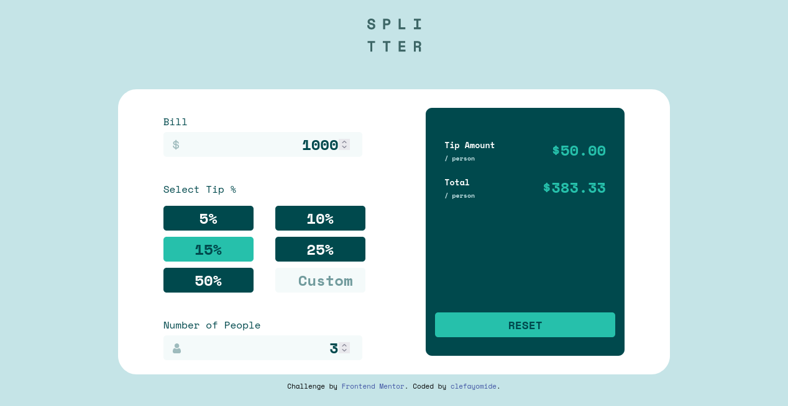

# Frontend Mentor - Tip calculator app solution

This is a solution to the [Tip calculator app challenge on Frontend Mentor](https://www.frontendmentor.io/challenges/tip-calculator-app-ugJNGbJUX). Frontend Mentor challenges help me improve my coding skills by building realistic projects.

## Table of contents

- [Overview](#overview)
  - [The challenge](#the-challenge)
  - [Screenshot](#screenshot)
  - [Links](#links)
- [My process](#my-process)
  - [Built with](#built-with)
  - [What I learned](#what-i-learned)
- [Author](#author)

## Overview

### The challenge

Users should be able to:

- View the optimal layout for the app depending on their device's screen size
- See hover states for all interactive elements on the page
- Calculate the correct tip and total cost of the bill per person

### Screenshot



### Links

- [solution URL](https://your-solution-url.com)
- [live site URL](https://clefayomide.github.io/tip-calc/)

## My process

### Built with

- Semantic HTML5 markup
- CSS custom properties
- Flexbox
- [Vanilla JavaScript](https://www.javascript.com/)
- Mobile-first workflow

### What I learned

While building this project, i learnt about the practical use of some javascript string methods, like:
```js
includes()
slice()
```
These above methods gives you the power to check for a substring in a string. For example, while building this project, i needed to know if the user has entered a % in the custom input for tip:
```js
if(e.target.value.includes("%")){
  e.target.value.slice(0,-1)
}
```
The ```includes("%")``` checks for % substring, if found in the users input, the ```slice(0,-1)``` then removes the substring at the last index. 

## Author

- Frontend Mentor - [@clefayomide](https://www.frontendmentor.io/profile/clefayomide)
- Twitter - [@olorunfemivic18](https://www.twitter.com/olorunfemivic18)